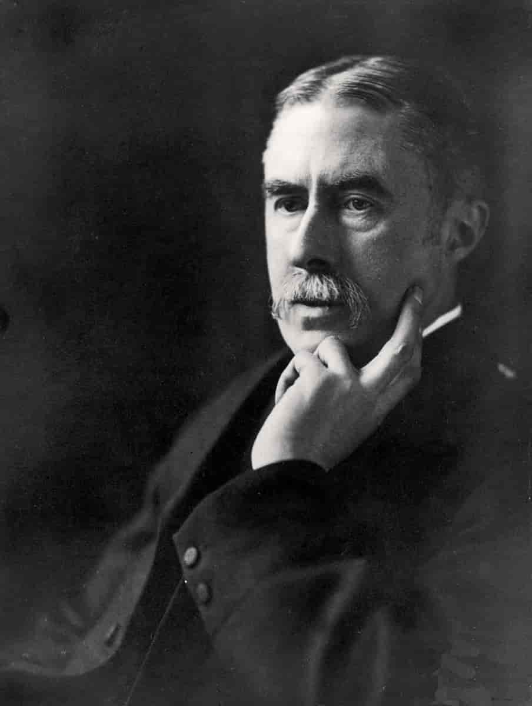

# 01. {-}

Đó là một trải nghiệm buồn cho một nhà toán học thực thụ khi thấy mình đang viết về toán
học. Nhiệm vụ của một nhà toán học là làm một cái gì đó, chứng minh những định lý mới, để
làm phong phú nền toán học, chứ không phải là đi nói về những cái mình hay người khác đã
và đang làm. Những chính khách coi thường các nhà xuất bản, những nhà hội họa thì coi
thường các nhà phê bình nghệ thuật, còn những nhà sinh-lý học, vật lý học và toán học cũng
thường mang những cảm giác tương tự. Không có sự khinh miệt nào sâu sắc hơn, hay nói
chung chính đáng hơn, của những người làm ra những thành quả và để cho những người khác
đi giải thích. Sự bày tỏ, phê bình, đánh giá là dành cho những người mang bộ óc thấp hơn.

Tôi có thể nhớ là đã thảo luận vấn đề này một lần trong một vài cuộc nói chuyện của mình với
Housman. Housman, trong bài giảng Leslie Stephen của anh ấy về ‘Tên gọi và bản chất của
thơ ca (The name and nature of poetry)’, đã phủ nhận một cách dứt khoát rằng anh ấy là một
‘nhà phê bình’; nhưng những lời phủ nhận của Housman lại có cảm giác rất ngoan cố và cho
thấy một sự ngưỡng mộ cho những phê bình văn học đã từng khiến tôi giật mình.

<i>Alfred Edward Housman (1859 - 1936) là một học giả và là một nhà thơ người Anh. Ông được đánh giá là một trong những học giả vĩ đại nhất mọi thời đại đặc biệt là đầu thế kỷ 20
</i>

Housman bắt đầu bằng một lời trích dẫn trong bài giảng đầu tiên của anh ấy hai mươi hai năm
về trước rằng

> “Tôi không thể nói chắc chắn phê bình văn học có phải là món quà quý giá nhất mà tạo hóa
có hay không; nhưng tạo hóa dường như nghĩ như vậy, vì hiển nhiên đó là món quà được ban
phát dè dặt nhất. Người diễn thuyết và nhà thơ..., nếu như ít hơn so với những quả dâu đen,
vẫn nhiều hơn số lần quay trở lại của sao chổi Halley: trong khi đó những nhà phê bình văn
học lại ít hơn như vậy...”

Và Housman tiếp tục 

> “Trong 22 năm qua, tôi đã tiến bộ một số mặt, thoái hóa một số mặt khác, nhưng tôi vẫn chưa
đủ khá hơn để trở thành một nhà phê bình văn học, cũng như chưa thoái hóa đến mức ngưỡng
mộ con người của tôi bây giờ.”

Tôi thấy thất vọng khi một nhà học giả vĩ đại, một nhà thơ lớn lại viết ra như vậy, và vì thế,
trong hội trường một vài tuần sau đó, tôi đã chen vào và hỏi Housman.

Liệu Housman có thật sự nghĩ như những gì ông đã nói? Chả nhẽ với ông cuộc đời của nhà
phê bình xuất sắc nhất lại có thể so sánh với của một nhà học giả hay một nhà thơ? Chúng tôi
đã tranh luận suốt cả bữa ăn, và tôi nghĩ cuối cùng thì Housman cũng đồng ý với tôi. Không
phải tôi đang tuyên bố chiến thắng với một người đã không còn bao giờ có thể tranh cãi với
tôi được nữa; nhưng đến cuối buổi tranh luận, câu trả lời của Housman cho câu hỏi đầu là "Có
lẽ không hoàn toàn như vậy" và "Có thể không" cho câu hỏi thứ hai.

Có một vài điểm còn nghi ngờ trong suy nghĩ của Housman, và tôi cũng không muốn lôi kéo
ông về phía mình; nhưng đó là điều chắc chắn trong suy nghĩ của những người làm khoa học;
tôi cũng không phải ngoại lệ. Nếu như một lúc nào đó tôi thấy mình không viết toán mà là viết
"về" toán học, thì đó là một lời thú tội về sự yếu kém, điều mà nhiều người trẻ tuổi và những
nhà toán học thực thụ cảm thấy tiếc cho bản thân tôi. Tôi đang viết về toán học bởi vì, như
những nhà toán học khác khi đã qua tuổi 60, tôi không bao giờ còn có thể suy nghĩ một cách
sảng khoái, còn năng lực hay kiên nhẫn để tiếp tục một cách có hiệu quả công việc thực thụ
của tôi.