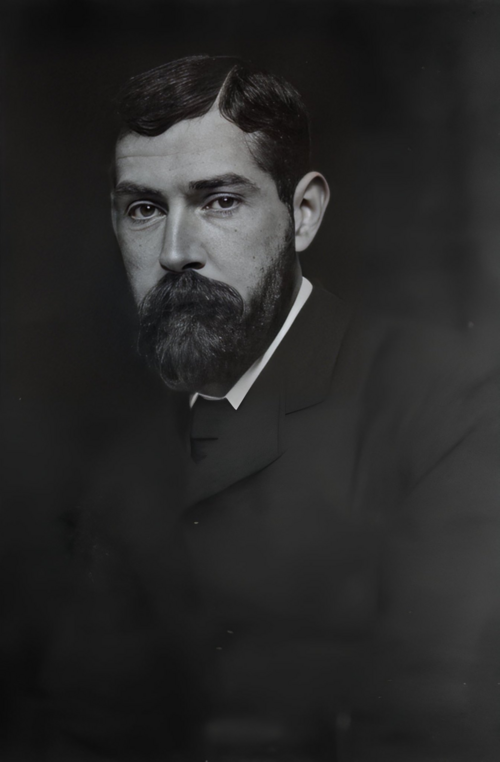

# 02. {-}

Tôi định đưa ra một lời xin lỗi cho toán học; và có thể ai đó sẽ nói điều đó là không cần thiết,
bởi vì ngày nay đã có một số công trình được công nhận rộng rãi là có ích và rất đáng ca tụng,
với lý do tốt hoặc xấu. Điều đó có lẽ là đúng; thực ra kể từ thành công vang dội của Einstein ,
thiên văn học các vì sao và vật lý nguyên tử dường như là hai ngành khoa học duy nhất trội
hơn hẳn trong đánh giá của mọi người. Một nhà toán học không cần thiết phải coi mình như
đang thủ thế. Không nhất thiết gặp phải sự đối nghịch như Bradley miêu tả việc bảo vệ của
thần học trong phần giới thiệu của cuốn "Bề ngoài và thực tế (Appearance and Reality)?”

<i>Francis Herbert Bradley (1846-1924) là một nhà triết học duy tâm người Anh. Tác phẩm quan trọng nhất của ông là cuốn Appearence and Reality (1893).</i>

Một nhà thần học, như Bradley viết, sẽ luôn được nghe mọi người nói "toàn bộ lý thuyết thần
học là không thể có được", hoặc "thậm chí nếu nó có thể đúng một phần nhỏ nào đó, nó cũng
hoàn toàn không thể đưa ra một ứng dụng thực tế nào". Cũng như vậy, "những vấn đề tương
tự, những cuộc tranh luận như nhau, những thất bại hoàn toàn giống nhau. Sao không quên
chúng đi và thoát ra khỏi vòng luẩn quẩn? Chả nhẽ không còn việc gì trên đời đáng giá hơn để
làm nữa hay sao?". Chắc chắn sẽ không có ai ngu ngốc đến mức dùng những lời đó cho toán
học. Khối lượng đồ sộ của chân lý toán học là hiển nhiên; những ứng dụng thực tế như cầu,
động cơ và máy hơi nước là không thể chối cãi. Có lẽ không ai cần phải thuyết phục là toán
học có lợi ích thực tế nào đó cho cuộc sống.

Tất cả, nếu hiểu như thế này, dường như rất thỏa mãn cho những nhà toán học, nhưng thực sự
một nhà toán học khó mà có thể chấp nhận được nó. Bất cứ nhà toán học thực thụ nào cũng
phải cảm thấy rằng toán học không phải dựa trên những kết quả, những điều tầm thường như
vậy, rằng danh tiếng và sự phổ biến rộng rãi của toán học đã được xây dựng phần lớn trên sự
nhầm lẫn và thiếu hiểu biết của đa số người, và rằng có cách bảo vệ toán học hợp lý hơn như
vậy. Dù thế nào đi nữa, tôi cũng quyết định sẽ đưa ra một lời giải thích. Điếu đó chắc sẽ là một
công việc dễ dàng hơn lời xin lỗi của Bradley rất nhiều.

Để như vậy, tôi sẽ hỏi tại sao nghiên cứu về toán học lại thực sự đáng giá? Điều gì là lời giải
thích hợp lý nhất cho cuộc đời của một nhà toán học? Và câu trả lời của tôi, như bao nhà toán
học khác, sẽ đại loại là: Tôi nghĩ điều đó đáng giá và có vô vàn lời giải thích. Nhưng tôi sẽ nói
trước là sự bảo vệ của tôi cho toán học sẽ là lời bảo vệ cho chính mình, và lời xin lỗi của tôi
về mặt nào đó có vẻ như hơi tự cao tự đại. Tôi sẽ không nghĩ việc xin lỗi cho toán học là đáng
giá nếu như tôi tự coi mình là một thất bại của chính bản thân nó.

Một phần của việc tự cao như thế này là không thể tránh khỏi, và tôi không nghĩ là cần phải
giải thích cho điều đó. Những công trình vĩ đại không bao giờ được làm bởi những con người
tầm thường. Một trong những nhiệm vụ đầu tiên của một nhà học giả là phải thổi phồng thêm
một ít về sự quan trọng về công việc của mình và những đóng góp của mình trong nó. Một
người luôn tự hỏi ***"Cái tôi đang làm có đáng giá không?"*** và ***"Tôi có đúng là người nên làm
nó không?"*** sẽ làm anh ta trở thành một người vô tích sự và làm nhụt chí của cả những người
khác. Điều anh ta nên làm là nhắm mắt lại một chút, nghĩ thêm một chút về công việc của
mình và về mình hơn là nó đã đáng giá. Việc đó không phải quá khó: cái khó hơn đó là không
được làm công việc của anh ta và chính mình trở nên lố bịch vì nhắm mắt lại quá chặt.