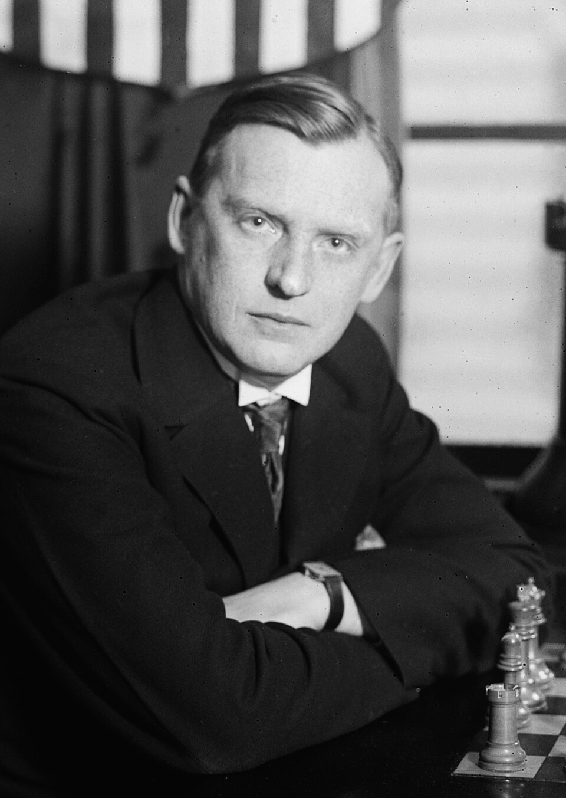

# 03. {-}

Một người muốn giải thích cho sự tồn tại và việc làm của mình thường phân biệt hai câu hỏi
khác nhau. Câu đầu tiên là công việc mà anh ta đang làm liệu có đáng giá không; và điều thứ
hai, tại sao anh ta lại làm việc đó, không kể đến giá trị của nó là như thế nào. Câu hỏi đầu
thường rất khó và dễ làm nản lòng, trong khi đó câu thứ hai lại khá đơn giản. Một cách trung
thực, câu trả lời cho chúng thường ở một trong hai thể loại; và loại thứ hai thường chỉ là một
biến hình của loại thứ nhất, câu trả lời mà chúng ta thực sự quan tâm. 

(I) ''Tôi làm cái tôi làm vì đó là một và cũng là cái duy nhất tôi có thể làm tốt. Tôi là một luật
sư, một người buôn bán chứng khoán, hay một cầu thủ cricket chuyên nghiệp bởi vì tôi có
năng khiếu thực sự cho công việc đó. Tôi là một luật sư vì tôi có một giọng lưỡi trôi chảy và
tôi thích sự tinh tế của môn luật; tôi là một người buôn bán chứng khoán vì sự phán đoán thị
trường của tôi rất tinh tế và nhanh nhạy; tôi là một cầu thủ cricket chuyên nghiệp vì tôi chơi
tốt không thể tưởng tượng được. Tôi cũng đồng ý có lẽ sẽ tốt hơn nếu như tôi trở thành một
nhà thơ, hay một nhà toán học, nhưng rất tiếc tôi lại không hề có một tý tài năng cho những
môn như vậy.'' 

Tôi không cho rằng đây là lời bảo vệ của đa số người, vì rất nhiều người không thể làm bất cứ
cái gì tốt cả. Nhưng chắc chắn đó là câu trả lời hợp lý, dù chỉ cho một phần nhỏ đại diện: có
lẽ 5 hay 10% số người có thể làm một việc gì đó tốt hơn hẳn. Nó còn là một phần nhỏ hơn
nhiều nữa cho những người có thể làm một việc gì đó "cực" tốt, và số người có thể làm hai
việc tốt liền là không đáng kể. Nếu một người nào đó có một chút ít tài năng, anh ta nên sẵn
sàng hy sinh tất cả để theo đuổi nó đến cùng.

Quan điểm này cũng đã từng được nhắc đến bởi tiến sỹ Johnson. Khi tôi bảo với anh ta tôi đã
từng được thấy (một người trùng tên) Johnson một lúc cưỡi ba con ngựa liền, anh ta nói ngay,

> ''Ông thấy không, một người như vậy phải được khuyến khích, vì tài năng của anh ta cho thấy
khả năng to lớn của loài người...''

và một cách tương tự, Johnson chắc đã vỗ tay khen ngợi những nhà leo núi, những người bơi
vượt kênh biển hay những người chơi cờ bịt mắt. Về phần tôi, tôi thực sự cảm kích với tất cả
những điều đó về những thành quả đáng kinh ngạc. Tôi cũng cảm kích ngay cả với những nhà
ảo thuật hay những người có khả năng nói tiếng bụng; và khi Alekhine và Bradman phá vỡ kỷ
lục trước đó, tôi đã rất thất vọng nếu như họ không đạt được như vậy. Và ở điểm này, Johnson
và tôi đều tìm thấy mình trong tiếng nói của công luận. Như W.J.Turner đã nói, chỉ có những
tay "cù lần" mới không ngưỡng mộ những người "tai to mặt lớn".

<i>Alexander Alekhine (1892 - 1946) là một vận động viên chơi cờ vua, và là vua cờ thứ tư, là vua cờ trong hai giai đoạn 1927 - 1935; 1937 - 1946</i>

Tất nhiên chúng ta phải phân biệt những tính chất khác nhau của mỗi công việc. Tôi thà là một
người viết tiểu thuyết hay một họa sỹ hơn là một chính khách với danh tiếng tương tự; và có
rất nhiều con đường dẫn đến sự nổi tiếng mà đa số chúng ta sẽ gạt bỏ ngay lập tức vì có thể
nguy hại. Mặc dù vậy, những sự khác nhau đó hiếm khi có thể thay đổi lựa chọn của một người
trong ngành nghề của mình, cái chính luôn là sự hạn chế trong khả năng của anh ta. Thơ ca có
giá trị hơn cricket, nhưng Bradman sẽ thành một chàng khờ nếu như anh ta từ bỏ môn cricket
để viết một vài bài thơ nhỏ loại hai (tôi chắc Bradman không thể làm tốt hơn thế). Nếu tài năng
của Bradman trong môn cricket bớt đi một chút, và thơ ca lại hơn thì sự lựa chọn có thể sẽ khó
hơn nhiều: Tôi không biết là tôi thích làm Victor Trumper hay Rupert Brooke nữa. Cũng may
là khă năng như vậy rất hiếm khi xảy ra.

Tôi có thể thêm vào rằng những người như vậy khó có thể trở thành những nhà toán học.
Thường thì có vẻ hơi phóng đại khi nói về sự khác nhau giữa trí tuệ của những nhà toán học
so với những người khác, nhưng không thể phủ nhận là năng khiếu cho toán học là một trong
những tài năng đặc biệt nhất, và thường rất khó có thể phân biệt giữa năng lực và sự uyên bác
của các nhà toán học. Nếu một người theo nghĩa nào đó là một nhà toán học thực sự, thì 100
ăn 1 là toán của anh ta tốt hơn hẳn so với tất cả những gì mà anh ý có thể làm, và sẽ rất ngu
ngốc nếu như anh ta lại đầu hàng, hay từ bỏ cơ hội phát huy tài năng của mình để chạy theo
một việc gì đó trong những ngành khác. Sự hy sinh đó chỉ có thể giải thích bằng nhu cầu mưu
sinh hay là do tuổi tác.