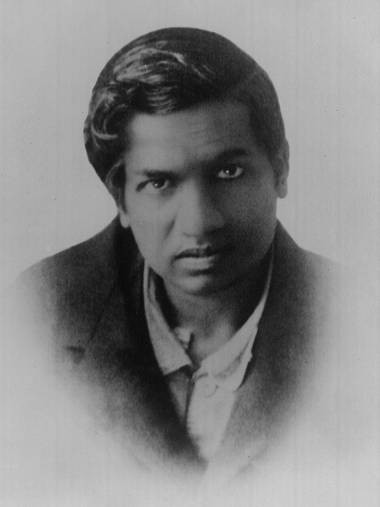

# 04. {-}
Tôi nên nói một vài điều ở đây về vấn đề tuổi tác, vì nó là điều đặc biệt quan trọng cho các
nhà toán học. Không có nhà toán học nào có thể cho phép mình quên rằng, toán học, hơn hẳn
các môn nghệ thuật và khoa học khác, là một trò chơi của những người trẻ tuổi. Lấy một ví dụ
đơn giản trong phạm vi nhỏ, tuổi trung bình của các thành viên trong viện hàn lâm là thấp nhất
cho toán học.

Chúng ta có thể đưa ra nhiều thí dụ to tát hơn nhiều. Ví dụ như, ta có thể xem sự nghiệp của
một con người chắc chắn là một trong ba nhà toán học vĩ đại nhất của thế giới. Newton từ bỏ
toán học ở tuổi 50, và thực sự thì đã không còn hứng thú từ trước đó rất lâu rồi; chắc chắn ở
tuổi 40 Newton đã nhận ra rằng những ngày tháng sáng tạo của mình sẽ không bao giờ còn
nữa. Công trình và ý tưởng lớn nhất của ông, về vi phân và lực vạn vật hấp dẫn, nảy sinh trong
đầu ông từ năm 1666, khi ông chỉ có 24 tuổi – ''những ngày đó, tôi đang ở đỉnh điểm cho
những phát minh, cho toán học và triết học hơn bao giờ hết''. Newton có một số công trình vĩ
đại khác khi ông gần 40 (quỹ đạo elliptic ở tuổi 37), nhưng sau đó thì ông làm rất ít và chỉ trau
chuốt cho những gì mình đã làm.

Galois mất năm 21 tuổi, Abel năm 27, Ramanujan ở tuổi 33 và Riemann năm 40. Có một số
người vẫn còn đưa ra những công trình vĩ đại một thời gian sau đó; kết quả của Gauss về hình
học vi phân được công bố năm ông 50 (mặc dù ông đã có ý tưởng này từ 10 năm trước đó).
Tôi không thể ngay lập tức đưa ra ví dụ về một thành tựu lớn đưa ra bởi một nhà toán học đã
qua tuổi 50. Nếu một người đã nhiều tuổi mất đi hứng thú cho và từ bỏ toán học, sự mất mát
đó có lẽ là không đáng kể, kể cả cho toán học hay cho bản thân ông ta

<i>Srinivasa Ramanujan (1887 - 1920), nhà toán học thiên tài Ấn Độ. Nhà toán học G.H.Hardy, người đã tận tình giúp đỡ Ramanujan trong thời gian Ramanujan ở Anh</i>

Một mặt khác, cái lợi cũng không được là mấy; những thành tích ghi lại được của những nhà
toán học đã bỏ toán cũng khá nản lòng. Newton làm công việc của mình khá tốt (chỉ khi ông
không cãi nhau với những người khác). Painlevé không phải là một thủ tướng thành công của
Pháp. Sự nghiệp chính trị của Laplace đầy tai tiếng, nhưng dù sao thì Laplace cũng không phải là một ví dụ tốt, thực sự ông không trung thực nhiều hơn là không có khă năng và không bao
giờ có thể ''từ bỏ'' toán học. Sẽ rất khó để tìm được một nhà toán học hạng nhất sau khi đã bỏ
toán mà vẫn dành được danh tiếng xuất sắc trong một ngành nào đó khác Cũng có thể có một
số người trẻ tuổi đã có thể thành những nhà toán học bậc nhất nếu anh ta theo đuổi toán học
nhưng tôi cũng chưa bao giờ được nghe một ví dụ lọt tai. Tuy nhiên tất cả những điều này chỉ
hoàn toàn xuất phát từ những kinh nghiệm rất hạn chế của bản thân tôi. Những nhà toán học
trẻ có tài năng thật sự mà tôi biết đều luôn chung thủy với toán học, và không hề thiếu tham
vọng, thậm chí còn thừa những điều đó; tất cả họ đều nhận ra rằng, nếu như có cái gọi là danh
vọng, thì đó là con đường sẽ dẫn họ đến.